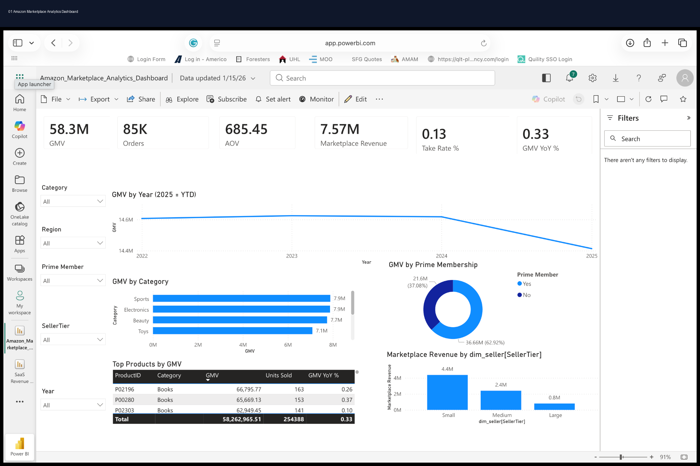

# 🛒 Amazon Marketplace Analytics Dashboard

<div align="center">

# 📊 Amazon Marketplace Analytics Dashboard

### Marketing Analytics • Ecommerce Analytics • Marketplace Intelligence • KPI Reporting

[](https://powerbi.microsoft.com/)
[](https://www.tableau.com/)
[](https://www.python.org/)
[](https://www.r-project.org/)
[](https://www.postgresql.org/)
[](https://www.microsoft.com/en-us/microsoft-365/excel)
[]()
[]()
[]()

</div>

---

# 📌 Project Overview

This project simulates a real-world **Amazon marketplace analytics environment** focused on:

- GMV performance
- Marketplace revenue analysis
- Seller performance
- Prime membership analytics
- Product category trends
- Revenue optimization
- Executive KPI reporting

The dashboard provides stakeholders with a centralized view of marketplace health, growth trends, customer purchasing behavior, and seller contribution performance.

---

# 🎯 Business Problem

Marketplace leadership lacked visibility into:
- seller performance,
- category-level revenue trends,
- Prime membership contribution,
- and overall marketplace growth.

The goal of this project was to create an executive dashboard that tracks marketplace KPIs and identifies opportunities to improve revenue performance and operational efficiency.

---

# 📊 Dashboard Preview

## Executive Marketplace Dashboard



---

# 📈 Key KPIs

| KPI | Description |
|---|---|
| GMV | Gross Merchandise Value |
| Orders | Total marketplace orders |
| AOV | Average Order Value |
| Marketplace Revenue | Marketplace commission revenue |
| Take Rate % | Marketplace commission percentage |
| GMV YoY % | Year-over-Year GMV growth |

---

# 🧠 Business Insights

- Prime members generated the majority of marketplace revenue.
- Electronics and Sports categories drove the highest GMV contribution.
- Small sellers contributed the highest marketplace revenue share.
- GMV growth slowed in later reporting periods, signaling optimization opportunities.
- Certain product categories demonstrated stronger YoY growth performance.

---

# 📂 Repository Structure

```text
01_README
02_Datasets
03_SQL
04_Python
05_R
06_SEO_SEM
07_Executive_Reports
08_KPI_Workbooks
09_Dashboard_Previews
10_Testimonials_Results
11_Presentations
12_PDF_Reports
```

---

# 📁 Dataset Information

## Dataset Includes
- Product performance data
- Seller tier data
- Order transactions
- Marketplace revenue
- Customer segmentation
- Prime membership indicators
- Category performance
- Geographic sales performance

## Dataset Files

```text
02_Datasets/
│
├── dataset.csv
├── data_dictionary.csv
└── README.md
```

---

# 💻 SQL Analysis

## SQL Focus Areas
- Revenue aggregation
- GMV trend analysis
- Category performance reporting
- Seller segmentation
- Marketplace KPI tracking

## Example SQL Analysis

```sql
SELECT
    Category,
    SUM(GMV) AS Total_GMV,
    SUM(Orders) AS Total_Orders
FROM marketplace_data
GROUP BY Category
ORDER BY Total_GMV DESC;
```

---

# 🐍 Python Analytics

## Python Libraries Used
- pandas
- numpy
- matplotlib
- plotly

## Python Analysis Focus
- Data cleaning
- KPI calculations
- Revenue trend analysis
- Category analysis
- Marketplace performance reporting

---

# 📊 R Analytics

## R Focus Areas
- Statistical reporting
- Marketplace trend analysis
- Revenue forecasting
- Seller performance analysis

---

# 📣 SEO & SEM Analysis

## Marketing Focus Areas
- Paid search optimization
- Product visibility
- Marketplace conversion optimization
- Revenue attribution
- Customer acquisition performance

## SEO/SEM Recommendations
- Increase investment in high-performing categories.
- Optimize product listing visibility.
- Improve conversion rates on high-traffic products.
- Expand Prime member retention strategies.

---

# 📈 Executive Reporting

This project includes:
- Executive PowerPoint presentation
- PDF business report
- KPI workbook
- Dashboard previews
- Stakeholder-ready summaries

---

# 📊 Dashboard Features

✔ Interactive KPI cards  
✔ Revenue trend analysis  
✔ Prime membership segmentation  
✔ Category-level performance tracking  
✔ Seller tier reporting  
✔ Marketplace revenue visualization  
✔ Dynamic filtering  

---

# 🚀 Business Recommendations

## Revenue Optimization
- Expand top-performing product categories.
- Increase support for high-performing sellers.
- Improve low-performing category conversion funnels.

## Seller Strategy
- Provide incentives for medium and large sellers.
- Improve seller onboarding analytics.

## Customer Strategy
- Increase Prime member engagement campaigns.
- Optimize customer retention programs.

---

# 🛠️ Tools Used

| Category | Tools |
|---|---|
| BI & Visualization | Power BI, Tableau |
| Analytics | Python, R, SQL |
| Spreadsheet Reporting | Excel |
| Reporting | PowerPoint, PDF |
| Marketing Analytics | SEO, SEM |

---

# 🎯 Skills Demonstrated

- Marketing Analytics
- Ecommerce Analytics
- Marketplace Intelligence
- Dashboard Design
- KPI Reporting
- SQL Analysis
- Python Analytics
- R Analytics
- Executive Reporting
- Business Storytelling

---

# 📌 Target Roles

- Marketing Analyst
- Product Analyst
- Ecommerce Analyst
- BI Analyst
- Growth Analyst
- Marketplace Analyst
- Digital Marketing Analyst

---

# 👨‍💻 Author

## Jamie Christian

- GitHub: https://github.com/JamieChristian22
- Main Portfolio: https://github.com/JamieChristian22/marketing-analytics-portfolio

---

<div align="center">

## ⭐ If you found this project valuable, feel free to star the repository!

</div>
