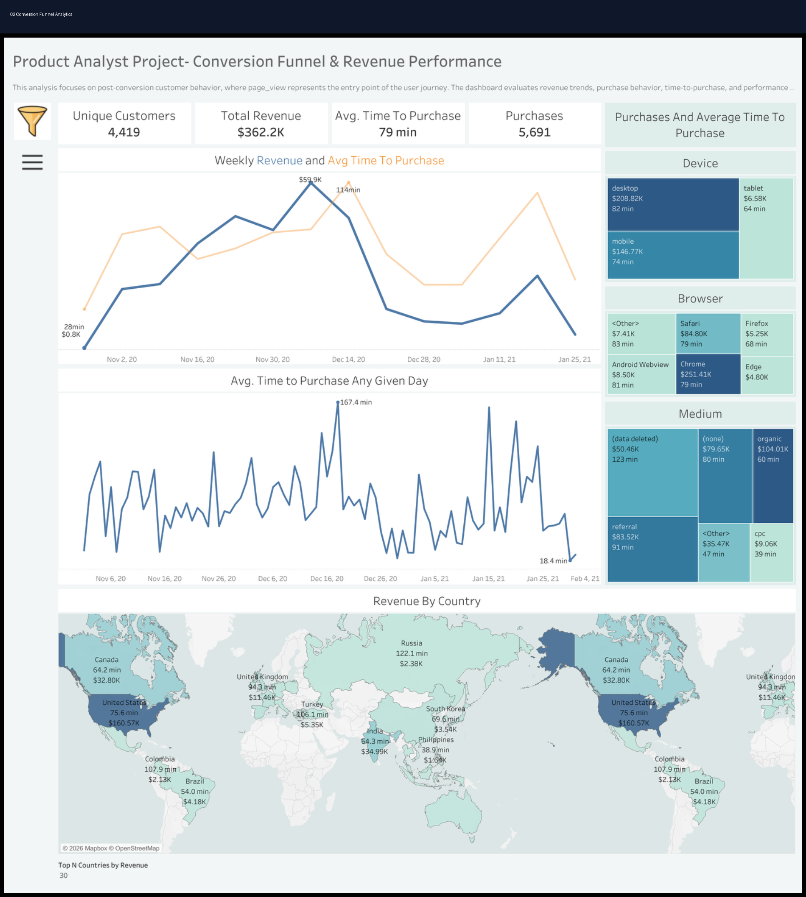

# 🔄 Conversion Funnel Analytics

<div align="center">

# 📊 Conversion Funnel Analytics Dashboard

### Funnel Analytics • Conversion Optimization • Customer Journey Analytics • KPI Reporting

[](https://powerbi.microsoft.com/)
[](https://www.tableau.com/)
[](https://www.python.org/)
[](https://www.r-project.org/)
[](https://www.postgresql.org/)
[](https://www.microsoft.com/en-us/microsoft-365/excel)
[]()
[]()
[]()

</div>

---

# 📌 Project Overview

This project simulates a real-world **conversion funnel analytics environment** focused on:

- Customer funnel progression
- Funnel drop-off analysis
- Checkout optimization
- Conversion performance tracking
- Revenue optimization
- Customer acquisition efficiency
- Executive KPI reporting

The dashboard helps stakeholders identify where customers abandon the funnel and which acquisition channels generate the strongest conversion performance.

---

# 🎯 Business Problem

Marketing and product teams lacked visibility into:
- where customers were abandoning the funnel,
- which channels produced the highest conversion rates,
- and how funnel inefficiencies impacted revenue.

The goal of this project was to build a conversion analytics dashboard capable of identifying funnel bottlenecks and optimization opportunities.

---

# 📊 Dashboard Preview

## Executive Conversion Funnel Dashboard



---

# 📈 Key KPIs

| KPI | Description |
|---|---|
| Landing Page Visits | Total visitors entering the funnel |
| Add-to-Cart Rate | % of users adding products to cart |
| Checkout Rate | % progressing to checkout |
| Purchase Conversion Rate | % completing purchases |
| Funnel Drop-Off Rate | % exiting the funnel |
| Revenue | Revenue generated through funnel conversions |

---

# 🧠 Business Insights

- Mobile users experienced the highest funnel abandonment rates.
- Email campaigns generated the strongest purchase conversion rates.
- Paid social traffic produced high sessions but lower checkout completion.
- Checkout-stage drop-off represented the largest revenue leakage point.
- Referral traffic demonstrated strong purchase intent and retention.

---

# 📂 Repository Structure

```text
01_README
02_Datasets
03_SQL
04_Python
05_R
06_SEO_SEM
07_Executive_Reports
08_KPI_Workbooks
09_Dashboard_Previews
10_Testimonials_Results
11_Presentations
12_PDF_Reports
```

---

# 📁 Dataset Information

## Dataset Includes
- Funnel session data
- Landing page visits
- Add-to-cart activity
- Checkout progression
- Purchase completion
- Device segmentation
- Revenue tracking
- Acquisition channel data

## Dataset Files

```text
02_Datasets/
│
├── dataset.csv
├── data_dictionary.csv
└── README.md
```

---

# 💻 SQL Analysis

## SQL Focus Areas
- Funnel stage aggregation
- Conversion performance reporting
- Device segmentation
- Channel analysis
- Revenue tracking

## Example SQL Analysis

```sql
SELECT
    Channel,
    SUM(Landing_Page_Visits) AS Visits,
    SUM(Purchased) AS Purchases,
    AVG(Overall_Conversion_Rate) AS Conversion_Rate
FROM funnel_data
GROUP BY Channel
ORDER BY Conversion_Rate DESC;
```

---

# 🐍 Python Analytics

## Python Libraries Used
- pandas
- numpy
- matplotlib
- seaborn
- plotly

## Python Analysis Focus
- Funnel stage calculations
- Conversion trend analysis
- Revenue analysis
- Device performance reporting
- Customer drop-off visualization

---

# 📊 R Analytics

## R Focus Areas
- Funnel conversion reporting
- Statistical trend analysis
- Retention analysis
- Conversion forecasting

---

# 📣 SEO & SEM Analysis

## Marketing Focus Areas
- Landing page optimization
- Paid search conversion analysis
- Funnel acquisition performance
- Retargeting opportunities
- Customer acquisition cost reduction

## SEO/SEM Recommendations
- Improve mobile landing page performance.
- Reduce checkout friction.
- Retarget cart abandoners through SEM campaigns.
- Optimize high-traffic landing pages for conversion.
- Shift spend toward high-converting acquisition channels.

---

# 📈 Executive Reporting

This project includes:
- Executive PowerPoint presentation
- PDF business report
- KPI workbook
- Funnel dashboard previews
- Stakeholder-ready business recommendations

---

# 📊 Dashboard Features

✔ Funnel stage visualization  
✔ Conversion KPI cards  
✔ Revenue performance analysis  
✔ Device segmentation  
✔ Acquisition channel reporting  
✔ Funnel drop-off tracking  
✔ Checkout conversion analysis  

---

# 🚀 Business Recommendations

## Funnel Optimization
- Simplify checkout workflows.
- Improve mobile conversion experience.
- Reduce form friction during checkout.

## Marketing Optimization
- Increase investment in high-converting channels.
- Improve retargeting strategy for cart abandoners.
- Optimize landing page content for paid campaigns.

## Revenue Growth
- Improve checkout completion rates.
- Reduce funnel abandonment.
- Increase average order value opportunities.

---

# 🛠️ Tools Used

| Category | Tools |
|---|---|
| BI & Visualization | Power BI, Tableau |
| Analytics | Python, R, SQL |
| Spreadsheet Reporting | Excel |
| Reporting | PowerPoint, PDF |
| Marketing Analytics | SEO, SEM |

---

# 🎯 Skills Demonstrated

- Funnel Analytics
- Marketing Analytics
- Ecommerce Analytics
- Dashboard Design
- KPI Reporting
- Conversion Optimization
- SQL Analysis
- Python Analytics
- R Analytics
- Executive Reporting

---

# 📌 Target Roles

- Marketing Analyst
- Product Analyst
- Growth Analyst
- Ecommerce Analyst
- BI Analyst
- Digital Marketing Analyst
- Conversion Rate Optimization Analyst

---

# 👨‍💻 Author

## Jamie Christian

- GitHub: https://github.com/JamieChristian22
- Main Portfolio: https://github.com/JamieChristian22/marketing-analytics-portfolio

---

<div align="center">

## ⭐ If you found this project valuable, feel free to star the repository!

</div>
