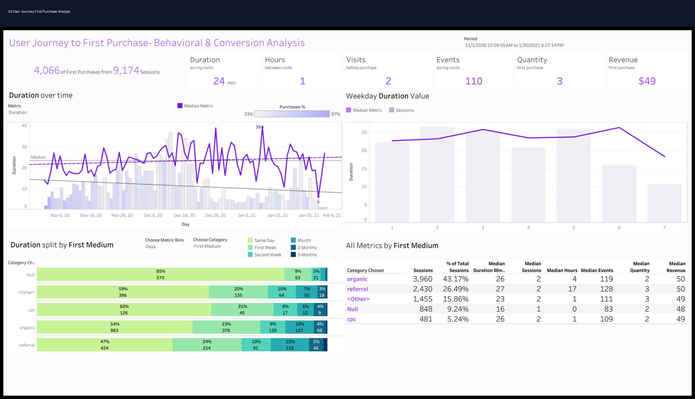

# 👣 User Journey First Purchase Analysis

<div align="center">

# 📊 User Journey First Purchase Analysis

### Customer Journey Analytics • Product Analytics • Behavioral Analytics • Conversion Intelligence

[](https://powerbi.microsoft.com/)
[](https://www.tableau.com/)
[](https://www.python.org/)
[](https://www.r-project.org/)
[](https://www.postgresql.org/)
[](https://www.microsoft.com/en-us/microsoft-365/excel)
[]()
[]()
[]()

</div>

---

# 📌 Project Overview

This project simulates a real-world **user journey and first purchase analytics environment** focused on:

- Customer acquisition behavior
- First purchase analysis
- Multi-touchpoint journey tracking
- User engagement analysis
- Retention measurement
- Revenue attribution
- Behavioral analytics
- Executive KPI reporting

The dashboard helps stakeholders understand how customers move from first interaction to initial purchase and which acquisition channels drive the strongest customer outcomes.

---

# 🎯 Business Problem

Growth and product teams lacked visibility into:
- how users progressed toward their first purchase,
- which channels created the highest-value customers,
- and which behaviors predicted stronger retention.

The goal of this project was to create a customer journey analytics dashboard that tracks first-purchase behavior and identifies opportunities to improve acquisition, conversion, and retention performance.

---

# 📊 Dashboard Preview

## Executive User Journey Dashboard



---

# 📈 Key KPIs

| KPI | Description |
|---|---|
| Sessions Before Purchase | Number of sessions before first conversion |
| Time to First Purchase | Time required to convert a new customer |
| Revenue per First Purchase | Revenue generated during initial conversion |
| Events Before Conversion | Engagement activity before purchase |
| Retention Rate | Customer retention after first purchase |
| Acquisition Channel Performance | Performance by traffic source |

---

# 🧠 Business Insights

- Referral and email channels generated the fastest first-purchase conversions.
- Mobile users required more sessions before purchasing compared to desktop users.
- Users with higher engagement activity demonstrated stronger retention rates.
- Organic search users generated higher long-term customer value.
- Longer session durations correlated with higher conversion probability.

---

# 📂 Repository Structure

```text
01_README
02_Datasets
03_SQL
04_Python
05_R
06_SEO_SEM
07_Executive_Reports
08_KPI_Workbooks
09_Dashboard_Previews
10_Testimonials_Results
11_Presentations
12_PDF_Reports
```

---

# 📁 Dataset Information

## Dataset Includes
- Customer acquisition channels
- User sessions
- Event tracking
- Device segmentation
- Geographic analysis
- First purchase revenue
- Session duration metrics
- Retention indicators

## Dataset Files

```text
02_Datasets/
│
├── dataset.csv
├── data_dictionary.csv
└── README.md
```

---

# 💻 SQL Analysis

## SQL Focus Areas
- Customer journey aggregation
- Session behavior analysis
- Revenue attribution
- Retention analysis
- Acquisition channel reporting

## Example SQL Analysis

```sql
SELECT
    First_Medium,
    AVG(Sessions_Before_Purchase) AS Avg_Sessions,
    AVG(First_Purchase_Revenue) AS Avg_Revenue,
    AVG(Retained_30_Days) AS Retention_Rate
FROM user_journey_data
GROUP BY First_Medium
ORDER BY Avg_Revenue DESC;
```

---

# 🐍 Python Analytics

## Python Libraries Used
- pandas
- numpy
- matplotlib
- seaborn
- plotly

## Python Analysis Focus
- User segmentation
- Customer behavior analysis
- Journey path visualization
- Retention trend reporting
- Revenue attribution analysis

---

# 📊 R Analytics

## R Focus Areas
- Behavioral trend analysis
- Customer retention reporting
- Journey progression analysis
- Statistical customer segmentation

---

# 📣 SEO & SEM Analysis

## Marketing Focus Areas
- Acquisition channel quality
- First-touch attribution
- Customer acquisition optimization
- Retargeting opportunities
- SEO landing page analysis

## SEO/SEM Recommendations
- Improve SEO landing pages for high-intent traffic.
- Increase investment in referral acquisition campaigns.
- Retarget users with multiple sessions but no purchase.
- Optimize email nurture sequences for conversion acceleration.
- Reduce friction for mobile customer journeys.

---

# 📈 Executive Reporting

This project includes:
- Executive PowerPoint presentation
- PDF business report
- KPI workbook
- Customer journey dashboard previews
- Stakeholder-ready recommendations

---

# 📊 Dashboard Features

✔ Customer journey visualization  
✔ First-touch attribution reporting  
✔ Revenue segmentation  
✔ Session behavior tracking  
✔ Retention KPI cards  
✔ Device performance analysis  
✔ Acquisition channel reporting  

---

# 🚀 Business Recommendations

## Acquisition Strategy
- Increase investment in high-retention acquisition channels.
- Improve referral marketing programs.
- Expand organic acquisition strategy.

## Conversion Optimization
- Reduce friction during first-time user onboarding.
- Improve mobile user experience.
- Optimize conversion touchpoints.

## Retention Strategy
- Personalize follow-up engagement campaigns.
- Improve onboarding content for new customers.
- Retarget high-intent non-converting users.

---

# 🛠️ Tools Used

| Category | Tools |
|---|---|
| BI & Visualization | Power BI, Tableau |
| Analytics | Python, R, SQL |
| Spreadsheet Reporting | Excel |
| Reporting | PowerPoint, PDF |
| Marketing Analytics | SEO, SEM |

---

# 🎯 Skills Demonstrated

- Customer Journey Analytics
- Product Analytics
- Behavioral Analytics
- Marketing Analytics
- Dashboard Design
- KPI Reporting
- SQL Analysis
- Python Analytics
- R Analytics
- Executive Reporting

---

# 📌 Target Roles

- Product Analyst
- Growth Analyst
- Marketing Analyst
- Ecommerce Analyst
- BI Analyst
- Customer Insights Analyst
- Digital Marketing Analyst

---

# 👨‍💻 Author

## Jamie Christian

- GitHub: [JamieChristian22 GitHub](https://github.com/JamieChristian22?utm_source=chatgpt.com)
- Main Portfolio: [Marketing Analytics Portfolio](https://github.com/JamieChristian22/marketing-analytics-portfolio?utm_source=chatgpt.com)

---

<div align="center">

## ⭐ If you found this project valuable, feel free to star the repository!

</div>
