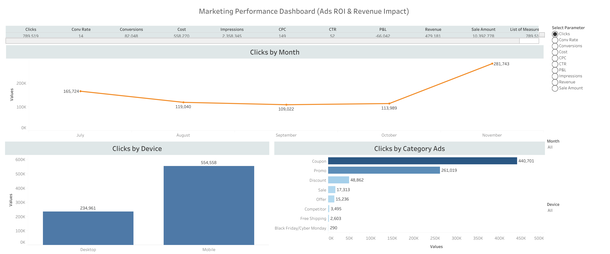

# 💰 Marketing ROI & Budget Optimization

<div align="center">

# 📊 Marketing Performance Dashboard  
### Ads ROI • Revenue Impact • SEM Performance • Campaign Optimization

[](https://www.tableau.com/)
[]()
[]()
[]()
[]()
[]()
[]()
[]()
[]()

</div>

---

# 📌 Project Overview

This project analyzes **marketing ad performance, ROI, revenue impact, and campaign efficiency** using a dashboard focused on clicks, conversion rate, conversions, cost, impressions, CPC, CTR, profit/loss, revenue, and sales amount.

The dashboard helps marketing teams understand which ad categories, devices, and monthly campaign periods are driving the strongest performance.

---

# 🎯 Business Problem

Marketing leadership needed better visibility into:

- ad spend efficiency,
- click performance,
- campaign revenue impact,
- conversion performance,
- device-level engagement,
- and category-level ad performance.

The goal was to create a dashboard that helps determine which paid marketing campaigns are producing strong results and which areas need optimization.

---

# 📊 Dashboard Preview



---

# 📈 Key Dashboard Metrics

| Metric | Value |
|---|---:|
| Clicks | 789,519 |
| Conversion Rate | 14 |
| Conversions | 82,048 |
| Cost | 558,270 |
| Impressions | 2,358,345 |
| CPC | 149 |
| CTR | 52 |
| P&L | -66,042 |
| Revenue | 479,181 |
| Sale Amount | 10,392,778 |

---

# 🧠 Business Insights

- Mobile generated significantly more clicks than desktop.
- November produced the strongest click volume.
- Coupon ads drove the highest click activity.
- Promo ads were the second strongest category.
- Discount, Sale, Offer, Competitor, Free Shipping, and Black Friday/Cyber Monday campaigns had much lower click contribution.
- Despite strong click volume, P&L was negative, showing that campaign cost efficiency needs improvement.
- The dashboard suggests the business should evaluate whether high-click campaigns are converting profitably.

---

# 📊 Dashboard Views

## Clicks by Month
Tracks monthly click performance from July through November.

## Clicks by Device
Compares desktop and mobile click behavior.

## Clicks by Category Ads
Ranks ad categories by click contribution.

## Select Parameter
Allows users to switch between key measures such as:

- Clicks
- Conversion Rate
- Conversions
- Cost
- CPC
- CTR
- P&L
- Impressions
- Revenue
- Sale Amount

---

# 🚀 Business Recommendations

## Campaign Optimization
- Reduce spend on campaigns with weak revenue or negative profit contribution.
- Continue monitoring Coupon and Promo campaigns since they drive the highest clicks.
- Test whether high-click campaigns also produce high conversions and revenue.

## SEM Optimization
- Improve CPC efficiency by reducing bids on low-converting ad categories.
- Separate high-intent campaigns from low-intent awareness campaigns.
- Reallocate spend toward campaigns with stronger conversion and revenue performance.

## Device Strategy
- Prioritize mobile campaign optimization because mobile drives the majority of clicks.
- Improve mobile landing pages to increase conversion rate.
- Test mobile-first ad copy and checkout flows.

## Revenue Growth
- Track revenue and P&L alongside clicks to avoid optimizing only for traffic.
- Use conversion rate and revenue per click to identify profitable campaigns.
- Build a weekly performance review process for ads ROI and budget decisions.

---

# 📂 Repository Structure

```text
01_README
02_Datasets
03_SQL
04_Python
05_R
06_SEO_SEM
07_Executive_Reports
08_KPI_Workbooks
09_Dashboard_Previews
10_Testimonials_Results
11_Presentations
12_PDF_Reports
```

---

# 📁 Dataset Information

```text
02_Datasets/
│
├── dataset.csv
├── data_dictionary.csv
└── README.md
```

The dataset supports analysis of:

- clicks
- impressions
- conversions
- cost
- CPC
- CTR
- revenue
- sales amount
- ad category
- device
- month

---

# 💻 SQL Analysis

```sql
SELECT
    Ad_Category,
    SUM(Clicks) AS Total_Clicks,
    SUM(Conversions) AS Total_Conversions,
    SUM(Revenue) AS Total_Revenue,
    SUM(Cost) AS Total_Cost,
    SUM(Revenue) - SUM(Cost) AS Profit_Loss
FROM marketing_ads
GROUP BY Ad_Category
ORDER BY Total_Clicks DESC;
```

---

# 🐍 Python Analytics

Python can be used to:

- calculate ROI and P&L,
- compare device performance,
- analyze monthly trends,
- identify high-cost low-return campaigns,
- and visualize campaign efficiency.

---

# 📊 R Analytics

R can be used to:

- summarize campaign performance,
- compare conversion rates by category,
- calculate statistical differences between campaign groups,
- and evaluate revenue impact.

---

# 📣 SEO & SEM Analysis

## SEM Focus

This project is strongly aligned with **SEM / paid advertising analytics**.

Key SEM analysis areas:

- CPC efficiency
- CTR performance
- conversion rate
- revenue impact
- campaign cost
- profit/loss
- ad category performance

## SEM Recommendations

- Lower bids on ad categories with poor conversion performance.
- Increase budget only for campaigns with positive P&L.
- Test new ad copy for Coupon and Promo campaigns.
- Improve landing pages for high-click campaigns.
- Track revenue per click and conversion value, not just clicks.

---

# 🛠️ Tools Used

| Category | Tools |
|---|---|
| Dashboarding | Tableau |
| Analytics | SQL, Python, R |
| Reporting | Excel, PowerPoint, PDF |
| Marketing | SEM, Paid Ads, ROI Analysis |
| Business Intelligence | KPI Dashboarding |

---

# 🎯 Skills Demonstrated

- Marketing Analytics
- SEM Analytics
- Paid Ads Reporting
- Campaign Performance Analysis
- ROI Analysis
- Revenue Impact Analysis
- KPI Dashboarding
- Device Performance Analysis
- Ad Category Analysis
- Executive Reporting

---

# 📌 Target Roles

- Marketing Analyst
- Digital Marketing Analyst
- SEM Analyst
- Paid Media Analyst
- Performance Marketing Analyst
- Growth Analyst
- BI Analyst

---

# 👨‍💻 Author

## Jamie Christian

- GitHub: https://github.com/JamieChristian22
- Main Portfolio: https://github.com/JamieChristian22/marketing-analytics-portfolio

---

<div align="center">

## ⭐ Marketing Performance Dashboard — Ads ROI & Revenue Impact

</div>
