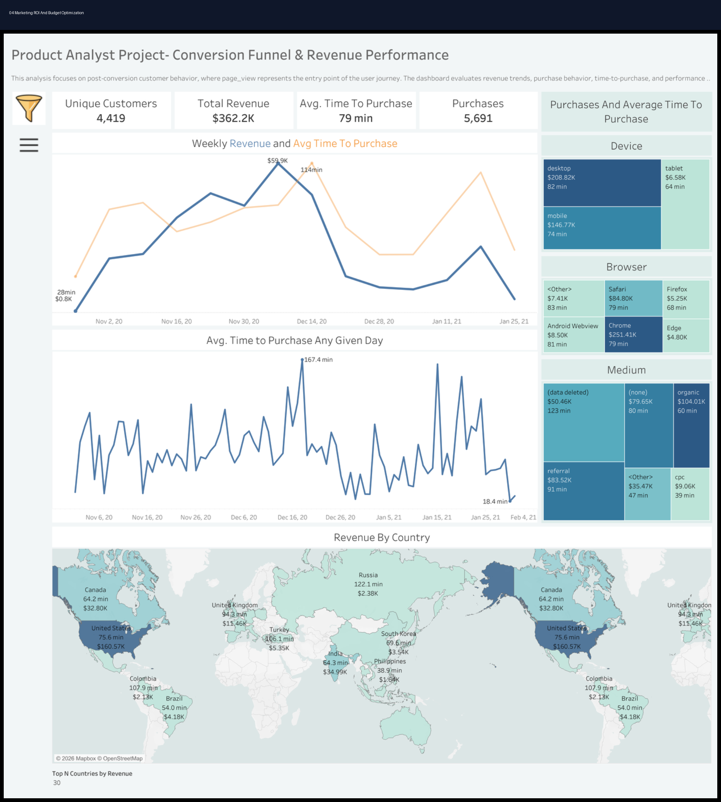

# 💰 Marketing ROI & Budget Optimization

<div align="center">

# 📊 Marketing ROI & Budget Optimization Dashboard

### Marketing Analytics • ROI Analysis • Budget Allocation • SEO & SEM Performance

[](https://powerbi.microsoft.com/)
[](https://www.tableau.com/)
[](https://www.python.org/)
[](https://www.r-project.org/)
[](https://www.postgresql.org/)
[](https://www.microsoft.com/en-us/microsoft-365/excel)
[]()
[]()
[]()
[]()

</div>

---

# 📌 Project Overview

This project simulates a real-world **marketing ROI and budget optimization environment** focused on:

- Marketing spend analysis
- ROI and ROAS optimization
- Campaign performance tracking
- SEO and SEM analysis
- Customer acquisition efficiency
- Budget allocation strategy
- Revenue attribution
- Executive KPI reporting

The dashboard helps marketing and executive teams understand how budget allocation impacts revenue performance and which channels generate the strongest return on investment.

---

# 🎯 Business Problem

Marketing leadership lacked visibility into:
- which campaigns generated the strongest ROI,
- where marketing spend was being wasted,
- and how SEO and SEM performance impacted revenue growth.

The goal of this project was to create a centralized dashboard for monitoring marketing efficiency and improving budget allocation decisions.

---

# 📊 Dashboard Preview

## Executive ROI Optimization Dashboard



---

# 📈 Key KPIs

| KPI | Description |
|---|---|
| ROI | Return on Investment |
| ROAS | Return on Ad Spend |
| CPC | Cost per Click |
| CPA | Cost per Acquisition |
| Revenue | Revenue generated from campaigns |
| Spend | Marketing budget allocation |
| Conversion Rate | Customer conversion performance |

---

# 🧠 Business Insights

- Email campaigns generated the highest ROI performance.
- Paid social campaigns produced strong traffic but weaker conversion efficiency.
- Organic search reduced long-term customer acquisition cost.
- SEM campaigns with branded keywords achieved the highest ROAS.
- Certain campaigns demonstrated rising spend without proportional revenue growth.

---

# 📂 Repository Structure

```text
01_README
02_Datasets
03_SQL
04_Python
05_R
06_SEO_SEM
07_Executive_Reports
08_KPI_Workbooks
09_Dashboard_Previews
10_Testimonials_Results
11_Presentations
12_PDF_Reports
```

---

# 📁 Dataset Information

## Dataset Includes
- Campaign performance data
- Marketing spend
- Revenue attribution
- SEO keyword performance
- SEM campaign metrics
- CPC and CPA tracking
- ROAS calculations
- Customer acquisition metrics

## Dataset Files

```text
02_Datasets/
│
├── dataset.csv
├── data_dictionary.csv
└── README.md
```

---

# 💻 SQL Analysis

## SQL Focus Areas
- ROI reporting
- Budget allocation analysis
- Campaign aggregation
- Revenue attribution
- SEO and SEM performance reporting

## Example SQL Analysis

```sql
SELECT
    Channel,
    SUM(Spend) AS Total_Spend,
    SUM(Revenue) AS Total_Revenue,
    AVG(ROAS) AS Avg_ROAS,
    AVG(ROI) AS Avg_ROI
FROM marketing_roi_data
GROUP BY Channel
ORDER BY Avg_ROI DESC;
```

---

# 🐍 Python Analytics

## Python Libraries Used
- pandas
- numpy
- matplotlib
- seaborn
- plotly

## Python Analysis Focus
- Marketing budget analysis
- ROI trend reporting
- Campaign performance analysis
- Revenue forecasting
- Spend optimization analysis

---

# 📊 R Analytics

## R Focus Areas
- Statistical ROI analysis
- Budget efficiency modeling
- Revenue trend analysis
- Campaign performance reporting

---

# 📣 SEO & SEM Analysis

## SEO Focus Areas
- Organic traffic optimization
- Keyword ranking analysis
- SEO revenue contribution
- Landing page performance

## SEM Focus Areas
- Paid search performance
- CPC optimization
- CPA reduction
- Campaign budget allocation

## SEO/SEM Recommendations
- Increase SEO investment for high-converting keywords.
- Shift SEM spend toward branded and high-intent campaigns.
- Reduce spend on underperforming paid social campaigns.
- Improve landing page quality scores.
- Optimize retargeting campaigns for abandoned users.

---

# 📈 Executive Reporting

This project includes:
- Executive PowerPoint presentation
- PDF business report
- KPI workbook
- ROI dashboard previews
- Stakeholder-ready business recommendations

---

# 📊 Dashboard Features

✔ ROI KPI cards  
✔ ROAS tracking  
✔ Budget allocation analysis  
✔ Revenue attribution reporting  
✔ Campaign performance visualization  
✔ SEO and SEM analysis  
✔ Conversion performance tracking  

---

# 🚀 Business Recommendations

## Budget Optimization
- Increase investment in high-performing channels.
- Reduce spend on campaigns with low ROI.
- Expand SEO investment to lower long-term acquisition costs.

## Campaign Optimization
- Improve paid search targeting.
- Optimize ad copy and landing page alignment.
- Focus on high-converting customer segments.

## Revenue Growth
- Improve customer retention strategies.
- Increase conversion optimization testing.
- Expand high-performing acquisition campaigns.

---

# 🛠️ Tools Used

| Category | Tools |
|---|---|
| BI & Visualization | Power BI, Tableau |
| Analytics | Python, R, SQL |
| Spreadsheet Reporting | Excel |
| Reporting | PowerPoint, PDF |
| Marketing Analytics | SEO, SEM |

---

# 🎯 Skills Demonstrated

- Marketing Analytics
- ROI Optimization
- Budget Allocation Analysis
- SEO Analytics
- SEM Analysis
- Dashboard Design
- KPI Reporting
- SQL Analysis
- Python Analytics
- Executive Reporting

---

# 📌 Target Roles

- Marketing Analyst
- Digital Marketing Analyst
- Performance Marketing Analyst
- Growth Analyst
- Ecommerce Analyst
- BI Analyst
- Product Analyst

---

# 👨‍💻 Author

## Jamie Christian

- GitHub: [JamieChristian22 GitHub](https://github.com/JamieChristian22?utm_source=chatgpt.com)
- Main Portfolio: [Marketing Analytics Portfolio](https://github.com/JamieChristian22/marketing-analytics-portfolio?utm_source=chatgpt.com)

---

<div align="center">

## ⭐ If you found this project valuable, feel free to star the repository!

</div>
