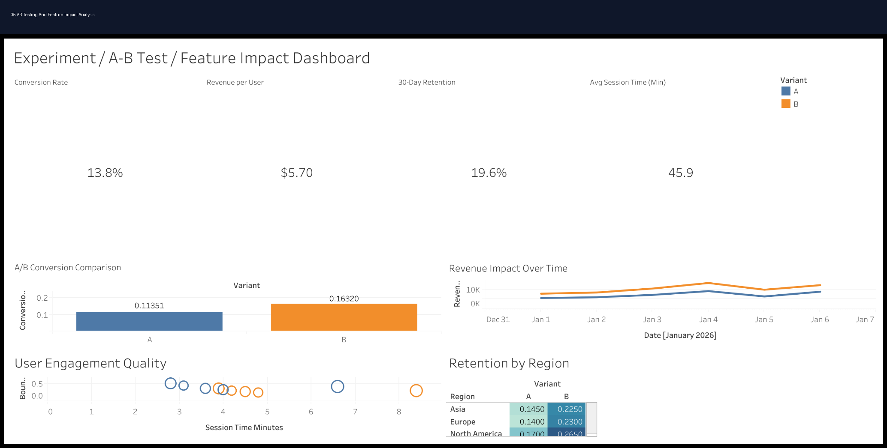

# 🧪 A/B Testing & Feature Impact Analysis

<div align="center">

# 📊 A/B Testing & Feature Impact Analysis Dashboard

### Experimentation Analytics • Product Analytics • Conversion Optimization • Feature Performance

[](https://powerbi.microsoft.com/)
[](https://www.tableau.com/)
[](https://www.python.org/)
[](https://www.r-project.org/)
[](https://www.postgresql.org/)
[](https://www.microsoft.com/en-us/microsoft-365/excel)
[]()
[]()
[]()

</div>

---

# 📌 Project Overview

This project simulates a real-world **A/B testing and feature experimentation environment** focused on:

- Feature impact analysis
- Product experimentation
- Conversion lift measurement
- Revenue impact analysis
- Retention tracking
- User engagement analysis
- Experiment performance reporting
- Executive KPI reporting

The dashboard helps product and growth teams evaluate whether new features improve conversion performance, customer engagement, and overall business outcomes.

---

# 🎯 Business Problem

Product and growth teams lacked visibility into:
- whether new features improved conversion performance,
- which variants generated stronger customer engagement,
- and how experimentation impacted retention and revenue growth.

The goal of this project was to create an experimentation analytics dashboard capable of measuring feature performance and supporting data-driven product decisions.

---

# 📊 Dashboard Preview

## Executive A/B Testing Dashboard



---

# 📈 Key KPIs

| KPI | Description |
|---|---|
| Conversion Rate | Percentage of users converting |
| Revenue per User | Revenue generated per visitor |
| Conversion Lift | Improvement between variants |
| Retention Rate | Customer retention after experiment |
| Bounce Rate | User abandonment percentage |
| Session Duration | Average user engagement time |

---

# 🧠 Business Insights

- Variant B generated significantly stronger conversion performance.
- Users exposed to the new feature demonstrated higher retention rates.
- Revenue per user improved under the experimental experience.
- Mobile users showed stronger engagement improvements compared to desktop users.
- Certain regions responded more positively to the experimental variant.

---

# 📂 Repository Structure

```text
01_README
02_Datasets
03_SQL
04_Python
05_R
06_SEO_SEM
07_Executive_Reports
08_KPI_Workbooks
09_Dashboard_Previews
10_Testimonials_Results
11_Presentations
12_PDF_Reports
```

---

# 📁 Dataset Information

## Dataset Includes
- Experiment variant assignment
- User sessions
- Conversion tracking
- Revenue performance
- Retention metrics
- Bounce rate analysis
- Device segmentation
- Geographic performance

## Dataset Files

```text
02_Datasets/
│
├── dataset.csv
├── data_dictionary.csv
└── README.md
```

---

# 💻 SQL Analysis

## SQL Focus Areas
- Variant performance aggregation
- Conversion lift analysis
- Revenue comparison
- Retention reporting
- User engagement analysis

## Example SQL Analysis

```sql
SELECT
    Variant,
    AVG(Conversion_Rate) AS Avg_Conversion_Rate,
    AVG(Revenue_Per_User) AS Avg_Revenue_Per_User,
    AVG(Retention_30_Day) AS Avg_Retention
FROM experiment_data
GROUP BY Variant
ORDER BY Avg_Conversion_Rate DESC;
```

---

# 🐍 Python Analytics

## Python Libraries Used
- pandas
- numpy
- matplotlib
- seaborn
- scipy
- plotly

## Python Analysis Focus
- Experiment performance analysis
- Conversion lift calculations
- Statistical significance testing
- Revenue impact reporting
- Variant comparison visualization

---

# 📊 R Analytics

## R Focus Areas
- Statistical experimentation analysis
- Hypothesis testing
- Retention trend analysis
- Feature impact reporting

---

# 📣 SEO & SEM Analysis

## Marketing Focus Areas
- Landing page experimentation
- Ad copy testing
- Conversion optimization
- Retargeting performance
- Acquisition quality analysis

## SEO/SEM Recommendations
- Use winning variants on high-traffic landing pages.
- Expand SEM campaigns using high-converting messaging.
- Retarget users who interacted but did not convert.
- Improve mobile conversion experience.
- Continue iterative experimentation cycles.

---

# 📈 Executive Reporting

This project includes:
- Executive PowerPoint presentation
- PDF business report
- KPI workbook
- Experiment dashboard previews
- Stakeholder-ready business recommendations

---

# 📊 Dashboard Features

✔ Variant performance comparison  
✔ Conversion KPI cards  
✔ Revenue impact analysis  
✔ Retention tracking  
✔ Engagement analysis  
✔ Device segmentation  
✔ Experiment lift visualization  

---

# 🚀 Business Recommendations

## Product Optimization
- Scale the highest-performing variant.
- Continue feature experimentation cycles.
- Improve low-performing user journeys.

## Conversion Optimization
- Deploy winning UX changes to high-traffic pages.
- Optimize onboarding experiences.
- Improve mobile feature engagement.

## Growth Strategy
- Expand high-performing acquisition campaigns.
- Align marketing messaging with successful experiment outcomes.
- Increase experimentation velocity across product features.

---

# 🛠️ Tools Used

| Category | Tools |
|---|---|
| BI & Visualization | Power BI, Tableau |
| Analytics | Python, R, SQL |
| Spreadsheet Reporting | Excel |
| Reporting | PowerPoint, PDF |
| Marketing Analytics | SEO, SEM |

---

# 🎯 Skills Demonstrated

- A/B Testing
- Experimentation Analytics
- Product Analytics
- Conversion Optimization
- KPI Reporting
- SQL Analysis
- Python Analytics
- Statistical Testing
- Dashboard Design
- Executive Reporting

---

# 📌 Target Roles

- Product Analyst
- Growth Analyst
- Marketing Analyst
- Experimentation Analyst
- Ecommerce Analyst
- BI Analyst
- Digital Marketing Analyst

---

# 👨‍💻 Author

## Jamie Christian

- GitHub: [JamieChristian22 GitHub](https://github.com/JamieChristian22?utm_source=chatgpt.com)
- Main Portfolio: [Marketing Analytics Portfolio](https://github.com/JamieChristian22/marketing-analytics-portfolio?utm_source=chatgpt.com)

---

<div align="center">

## ⭐ If you found this project valuable, feel free to star the repository!

</div>
