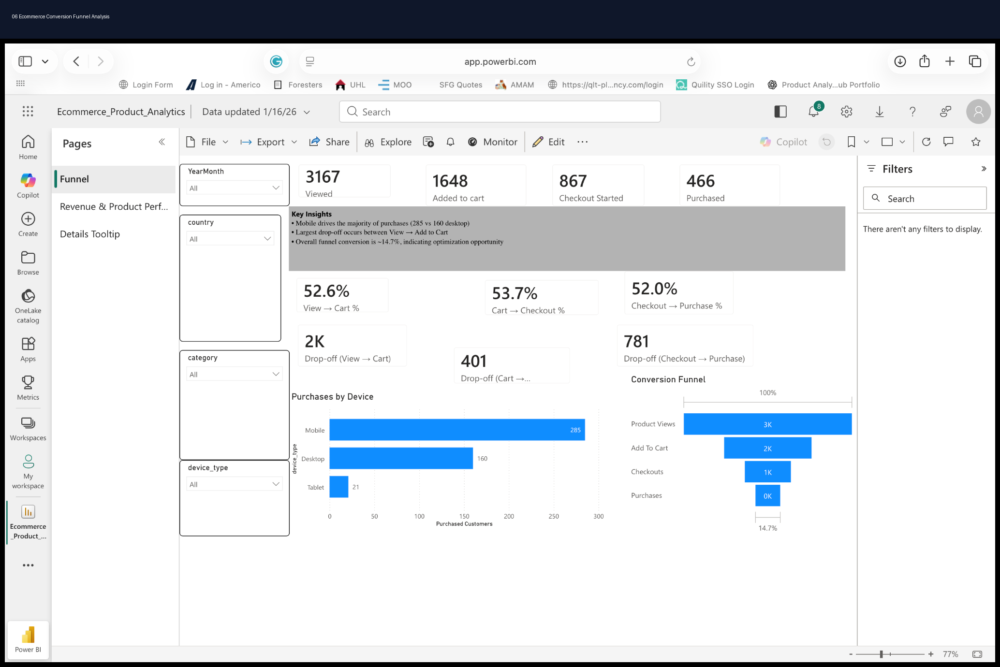

# 🛍️ Ecommerce Conversion Funnel Analysis

<div align="center">

# 📊 Ecommerce Conversion Funnel Analysis Dashboard

### Ecommerce Analytics • Funnel Optimization • Product Analytics • Revenue Intelligence

[](https://powerbi.microsoft.com/)
[](https://www.tableau.com/)
[](https://www.python.org/)
[](https://www.r-project.org/)
[](https://www.postgresql.org/)
[](https://www.microsoft.com/en-us/microsoft-365/excel)
[]()
[]()
[]()

</div>

---

# 📌 Project Overview

This project simulates a real-world **ecommerce conversion funnel analytics environment** focused on:

- Product funnel analysis
- Cart abandonment tracking
- Checkout optimization
- Revenue performance analysis
- Device segmentation
- Product category performance
- Customer purchase behavior
- Executive KPI reporting

The dashboard helps ecommerce, product, and marketing teams identify where customers abandon the purchase funnel and which optimizations can improve conversion and revenue performance. Funnel analysis is commonly used to measure user progression through purchase stages and identify conversion drop-off points. :contentReference[oaicite:0]{index=0}

---

# 🎯 Business Problem

Ecommerce leadership lacked visibility into:
- where customers abandoned the purchasing process,
- which devices generated the strongest conversion performance,
- and which product categories produced the highest revenue contribution.

The goal of this project was to build an ecommerce funnel analytics dashboard capable of identifying funnel inefficiencies, optimizing checkout performance, and improving revenue generation.

---

# 📊 Dashboard Preview

## Executive Ecommerce Funnel Dashboard



---

# 📈 Key KPIs

| KPI | Description |
|---|---|
| Product Views | Total product page visits |
| Add-to-Cart Rate | % of users adding products to cart |
| Checkout Rate | % progressing to checkout |
| Purchase Rate | % completing purchases |
| Cart Abandonment Rate | % abandoning before purchase |
| Revenue | Revenue generated through ecommerce conversions |

---

# 🧠 Business Insights

- Mobile users generated the highest traffic volume but experienced the highest cart abandonment rates.
- Electronics and Apparel categories produced the strongest ecommerce revenue contribution.
- Desktop users demonstrated stronger checkout completion rates than mobile users.
- Certain categories experienced significant drop-off between cart and checkout stages.
- Referral and email traffic generated stronger purchase conversion rates compared to paid social traffic.

---

# 📂 Repository Structure

```text
01_README
02_Datasets
03_SQL
04_Python
05_R
06_SEO_SEM
07_Executive_Reports
08_KPI_Workbooks
09_Dashboard_Previews
10_Testimonials_Results
11_Presentations
12_PDF_Reports
```

---

# 📁 Dataset Information

## Dataset Includes
- Product page activity
- Add-to-cart behavior
- Checkout progression
- Purchase transactions
- Revenue tracking
- Device segmentation
- Geographic analysis
- Product category performance

## Dataset Files

```text
02_Datasets/
│
├── dataset.csv
├── data_dictionary.csv
└── README.md
```

---

# 💻 SQL Analysis

## SQL Focus Areas
- Funnel stage aggregation
- Cart abandonment reporting
- Device conversion analysis
- Revenue tracking
- Product category performance

## Example SQL Analysis

```sql
SELECT
    Category,
    SUM(Product_Views) AS Product_Views,
    SUM(Purchases) AS Purchases,
    AVG(Checkout_to_Purchase_Rate) AS Purchase_Rate,
    SUM(Revenue) AS Revenue
FROM ecommerce_funnel_data
GROUP BY Category
ORDER BY Revenue DESC;
```

---

# 🐍 Python Analytics

## Python Libraries Used
- pandas
- numpy
- matplotlib
- seaborn
- plotly

## Python Analysis Focus
- Funnel drop-off analysis
- Revenue trend reporting
- Device segmentation
- Product category performance
- Checkout optimization reporting

---

# 📊 R Analytics

## R Focus Areas
- Funnel trend analysis
- Ecommerce performance reporting
- Statistical conversion analysis
- Revenue forecasting

---

# 📣 SEO & SEM Analysis

## SEO Focus Areas
- Product page optimization
- Organic ecommerce traffic analysis
- Search visibility improvement
- Category-level SEO performance

## SEM Focus Areas
- Shopping campaign optimization
- Retargeting strategy
- Paid search conversion analysis
- Cart abandonment recovery campaigns

## SEO/SEM Recommendations
- Improve SEO optimization for high-traffic product pages.
- Retarget cart abandoners using SEM campaigns.
- Improve mobile checkout performance.
- Optimize product page load speed and UX.
- Increase investment in high-converting product categories.

---

# 📈 Executive Reporting

This project includes:
- Executive PowerPoint presentation
- PDF business report
- KPI workbook
- Ecommerce dashboard previews
- Stakeholder-ready business recommendations

---

# 📊 Dashboard Features

✔ Funnel stage visualization  
✔ Cart abandonment tracking  
✔ Revenue KPI cards  
✔ Device performance reporting  
✔ Product category analysis  
✔ Geographic ecommerce insights  
✔ Checkout conversion reporting  

---

# 🚀 Business Recommendations

## Funnel Optimization
- Reduce checkout friction for mobile users.
- Simplify checkout workflows.
- Improve payment experience and page speed.

## Revenue Growth
- Expand investment in high-performing product categories.
- Improve cross-sell and upsell opportunities.
- Optimize ecommerce landing pages.

## Customer Experience
- Improve mobile shopping experience.
- Reduce cart abandonment through retargeting campaigns.
- Increase personalization for returning customers.

---

# 🛠️ Tools Used

| Category | Tools |
|---|---|
| BI & Visualization | Power BI, Tableau |
| Analytics | Python, R, SQL |
| Spreadsheet Reporting | Excel |
| Reporting | PowerPoint, PDF |
| Marketing Analytics | SEO, SEM |

---

# 🎯 Skills Demonstrated

- Ecommerce Analytics
- Funnel Analytics
- Marketing Analytics
- Product Analytics
- Dashboard Design
- KPI Reporting
- SQL Analysis
- Python Analytics
- R Analytics
- Executive Reporting

---

# 📌 Target Roles

- Ecommerce Analyst
- Marketing Analyst
- Product Analyst
- Growth Analyst
- BI Analyst
- Digital Marketing Analyst
- Conversion Rate Optimization Analyst

---

# 👨‍💻 Author

## Jamie Christian

- GitHub: [JamieChristian22 GitHub](https://github.com/JamieChristian22?utm_source=chatgpt.com)
- Main Portfolio: [Marketing Analytics Portfolio](https://github.com/JamieChristian22/marketing-analytics-portfolio?utm_source=chatgpt.com)

---

<div align="center">

## ⭐ If you found this project valuable, feel free to star the repository!

</div>
